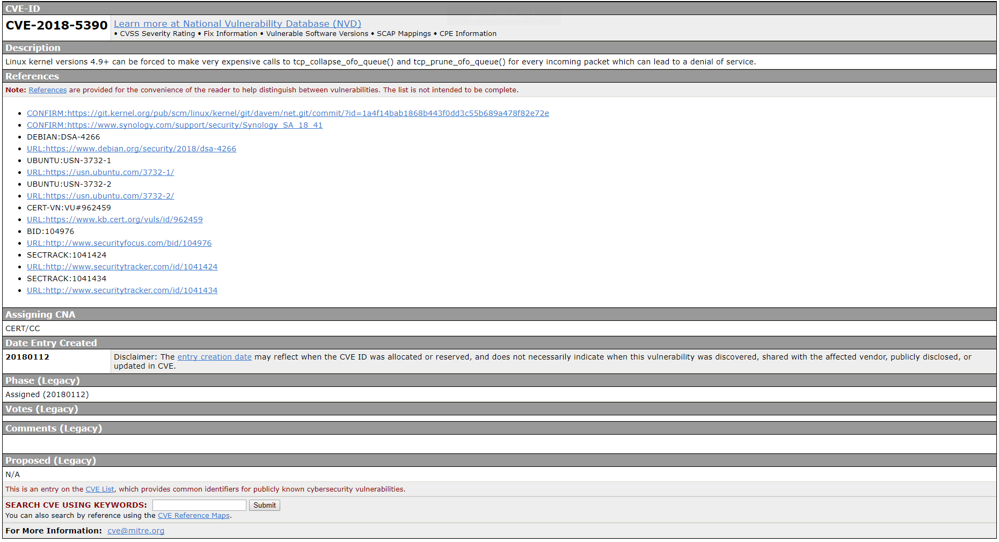

# analysis-cve

## CVE简介

CVE 的英文全称是“**Common Vulnerabilities & Exposures**”公共漏洞和暴露。CVE就好像是一个字典表，为广泛认同的信息安全漏洞或者已经暴露出来的弱点给出一个公共的名称。使用一个共同的名字，可以帮助用户在各自独立的各种漏洞数据库中和漏洞评估工具中共享数据，虽然这些工具很难整合在一起。这样就使得CVE成为了安全信息共享的“关键字”。如果在一个漏洞报告中指明的一个漏洞，如果有CVE名称，你就可以快速地在任何其它CVE兼容的数据库中找到相应修补的信息，解决安全问题。

**CVE 开始建立是在1999年9月**，起初只有321个条目。在2000年10月16日，CVE达到了一个重要的里程碑——超过1000个正式条目。截至目前（2000年12月30日），CVE已经达到了1077个条目，另外还有1047个候选条目（版本20001013）。至2013年已经有超过28个漏洞库和工具声明为CVE兼容。

## 产生背景

随着全球范围的黑客入侵不断猖獗，信息安全问题越来越严重。在对抗黑客入侵的安全技术中，实时入侵检测和漏洞扫描评估（IDnA——Intrusion Detection and Assessment）的技术和产品已经开始占据越来越重要的位置。

实时入侵检测和漏洞扫描评估基于的主要方法还是“已知入侵手法检测”和“已知漏洞扫描”，换句话说就是基于知识库的技术。可见，决定一个IDnA技术和产品的重要标志就是能够检测的入侵种类和漏洞数量。

1999年2月8日的 InfoWorld在比较当时ISS的Internet Scanner5.6和NAI的CyberCop2.5时有一段描述，“由于没有针对这些扫描器平台的分类标准，直接比较他们的数据库非常困难。我们找到在Internet Scanner和CyberCop中同一个漏洞采用了不同的名称……”

各个IDnA厂家在阐述自己产品的水平时，都会声称自己的扫描漏洞数最多，你说有1000种，我说有5000。我们的用户如何辨别？不同的厂家在入侵手法和漏洞这方面的知识库各有千秋，用户如何最大限度地获得所有安全信息？CVE就是在这样的环境下应运而生的。

## 特点

- 为每个漏洞和暴露确定了**唯一**的名称
- 给每个漏洞和暴露一个**标准化的描述**
- 不是一个数据库，而是一个**字典**
- 任何完全迥异的漏洞库都可以用同一个语言表述
- 由于语言统一，可以使得安全事件报告更好地被理解，实现更好的协同工作
- 可以成为评价相应工具和数据库的基准
- 非常容易从互联网查询和下载，
- 通过“CVE编辑部”体现业界的认可

## 例图

## 总结

## END
